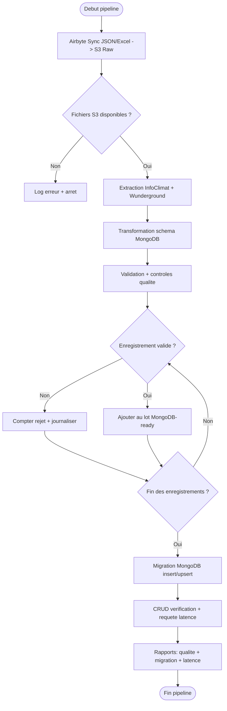

# Forecast 2.0 Pipeline - Livrables Mission

## 1) Contexte
Ce projet met en place une chaine Data Engineering pour:
- collecter des donnees meteo depuis des sources Excel et JSON via Airbyte,
- stocker les donnees brutes dans AWS S3,
- transformer les donnees vers un schema compatible MongoDB,
- migrer les donnees vers MongoDB,
- mesurer la qualite des donnees et le temps d'accessibilite.

Audit ECS-only (suppression reliquats Atlas + optimisation): `docs/audit_ecs_only_2026-02-18.md`

## 2) Architecture technique

`Airbyte (JSON + Excel) -> S3 (raw) -> ETL Python (transform/validate) -> MongoDB -> reporting qualite + latence`

## 3) Logigramme processus
Le logigramme formel est disponible dans `docs/process_flowchart.mmd`.



## 4) Installation environnement

### Prerequis
- Python 3.10+
- Poetry
- Docker Desktop
- AWS credentials (acces S3)
- URI MongoDB cible (ECS/local)

### Installation
```bash
poetry install
cp env.example .env
# renseigner .env
```

## 4bis) requirements.txt
Le fichier `requirements.txt` est fourni avec versions exactes (pinned) pour recreer un environnement virtuel compatible:

```bash
pip install -r requirements.txt
```

## 4ter) Organisation des dossiers

- `src/`: code Python applicatif (ETL, loaders, utilitaires, tests).
- `src/scripts/`: scripts Python executables via Poetry (`poetry run ...`).
- `ops/`: scripts shell d'exploitation/infra (deploy Terraform, cron local, ops AWS).
- `infra/terraform/`: infrastructure as code.
- `docs/`: documentation architecture et runbooks.

Convention:
- `src/scripts/*` = Python runtime du pipeline.
- `ops/*` = shell/infra uniquement.

## 5) Airbyte -> S3 (Excel + JSON)
Guide complet: `docs/airbyte_setup_s3.md`

Objectif attendu:
- Connection Airbyte JSON -> S3 prefix `airbyte-sync/infoclimat/`
- Connection Airbyte Excel/CSV -> S3 prefix `airbyte-sync/wunderground/`

## 6) Scripts livrables

### A. Transformation vers format MongoDB
Script: `src/scripts/transform_to_mongodb.py`

```bash
# Mode S3
poetry run transform-mongodb --source-mode s3 --date 2026-02-12

# Mode local (debug)
poetry run transform-mongodb \
  --source-mode local \
  --infoclimat-file ./data/raw/infoclimat.json \
  --wunderground-file ./data/raw/wunderground.json
```

Sortie:
- `data/processed/mongodb_ready_records.json`
- `logs/quality_report_transform_*.json`

### B. Migration vers MongoDB
Script: `src/scripts/migrate_to_mongodb.py`

```bash
# Insert depuis fichier local
poetry run migrate-mongodb --input ./data/processed/mongodb_ready_records.json

# Upsert
poetry run migrate-mongodb --input ./data/processed/mongodb_ready_records.json --upsert

# Insert depuis S3 processed (dernier fichier de la date)
poetry run migrate-mongodb --input-s3-date 2026-02-18

# Insert depuis S3 processed (dernier fichier global)
poetry run migrate-mongodb --input-s3-latest
```

Sortie:
- `logs/migration_report_*.json`
- inclut `error_rate` post migration

### C. CRUD MongoDB via script Python
Script: `src/scripts/mongodb_crud.py`

```bash
poetry run mongodb-crud
```

Operations executees:
- Create
- Read
- Update
- Delete

### D. Reporting temps d'accessibilite
Script: `src/scripts/query_latency_report.py`

```bash
poetry run latency-report --station-id ILAMAD25 --date 2026-02-12 --iterations 10
```

Sortie:
- `logs/query_latency_report_*.json`
- `min/max/avg` de latence requete

## 7) Qualite des donnees post migration
Le taux d'erreur est calcule dans `migrate_to_mongodb.py`:
- `error_rate = rejected_records / input_records`

Les details qualite sont fournis par `QualityChecker`.

## 8) Collections MongoDB et schema
Schema cible: `src/config/mongodb_schema.json`

Collection principale:
- `weather_measurements`

Index crees via `MongoDBLoader`:
- `station.id + timestamp`
- `station.network + timestamp`
- index geospatial `station.location_geo`

## 9) Support de presentation
Trame prete: `docs/presentation_support.md`

Inclut les elements demandes:
- contexte mission
- demarche technique
- justification des choix
- schema base
- logigramme
- preuves Airbyte et AWS (captures)
- reporting qualite et latence

## 10) Tests
```bash
pytest -vv src/tests
```

## 11) Docker (ECS/remote vs Mongo local)

### ECS/remote Mongo (mode default)
Prerequis: `MONGODB_URI` dans `.env`.

```bash
docker compose up --build
```

### Mongo local "clean" (sans profiles)

```bash
docker compose -f docker-compose.yml -f docker-compose.local.yml up --build
```

Test rapide de la collection via mongosh (local):
```bash
make mongo-shell
# puis dans mongosh:
# use forecast_2_0
# db.weather_measurements.countDocuments()
```

### Credentials AWS (important)
- Ne pas stocker `AWS_ACCESS_KEY_ID` / `AWS_SECRET_ACCESS_KEY` dans `.env` pour ce projet.
- Utiliser `AWS_PROFILE=default` + `AWS_REGION=eu-west-1` (et `AWS_DEFAULT_REGION=eu-west-1`).
- Verifier l'identite active avant un run:
  ```bash
  aws sts get-caller-identity
  ```
- Si une ancienne session exporte des cles AWS invalides:
  ```bash
  unset AWS_ACCESS_KEY_ID AWS_SECRET_ACCESS_KEY AWS_SESSION_TOKEN
  export AWS_PROFILE=default AWS_REGION=eu-west-1 AWS_DEFAULT_REGION=eu-west-1
  ```

## 12) Observabilité & planification

### Logs structurés et métriques EMF
- `setup_logger` peut continuer à écrire un log texte local ou produire du JSON (`LOG_FORMAT=json`) avec `set_run_context` injecté pour `run_id`, `target_date`, `stage`, `dry_run`, etc. Tous les handlers alimentent `logs/` (et `stdout` pour CloudWatch via ECS).
- Chaque exécution écrit `logs/pipeline_status.json`, `logs/quality_report_*.json`, `logs/migration_report_*.json` ainsi que les rapports de latence `logs/query_latency_report_*.json`. Utilise ces artefacts pour vérifier la fraîcheur, les rejets et la latence en post mortem.
- Le helper `utils.monitoring.emit_pipeline_metrics` imprime une ligne JSON EMF sur `stdout` avec `Namespace=Forecast2Pipeline`, dimensions `env` + `cluster` (par défaut `ecs`), et métriques `duration_seconds`, `records_*`, `error_rate`, `run_success`. Configure un log group CloudWatch pour parser ces lignes et créer des métriques/alertes dans CloudWatch sans agent additionnel.

### Cron local (fallback)
- Le script `ops/cron-run-pipeline.sh` définit `TARGET_DATE` sur la veille UTC (ou prend un argument), source le `.env`, génère un `RUN_ID`, puis lance `docker compose run --rm pipeline` avec `--date`, ce qui rend la planification portable sur n’importe quel hôte Linux.
- Exemples de crontab (ajuster le chemin) :
  ```
  # tous les jours à 05:00 UTC
  0 5 * * * /bin/bash /path/to/forecast-2-0-pipeline/ops/cron-run-pipeline.sh >> /path/to/forecast-2-0-pipeline/logs/cron.log 2>&1
  ```
- Tu peux passer une date spécifique : `ops/cron-run-pipeline.sh 2026-02-12`. Le log `cron.log` capture la date exécutée, le `RUN_ID` utilisé et les sorties `loguru`.

### Planification hebdomadaire ECS (production actuelle)

Important:
- Le schedule hebdomadaire n'est pas defini dans un fichier du repo.
- Il est stocke dans AWS EventBridge (ressource distante), regle `forecast-pipeline-weekly`.

Configuration active (mise a jour le 2026-02-18):
- Rule: `forecast-pipeline-weekly`
- Schedule expression: `cron(0 22 ? * WED *)`
- Timezone effective EventBridge Rule: UTC
- Cluster cible: `forecast-prod-mongo-cluster`
- Task definition cible: `forecast-pipeline-ecs:3` (sans auth MongoDB, `MONGODB_URI` en env)
- Network: subnets `subnet-01ec17ee34fdbcbf6,subnet-0403a7c24fb649b8c,subnet-0631d4f7da0f7a822`, SG `sg-062056db10833656d`

Verifier la regle:
```bash
aws events describe-rule \
  --name forecast-pipeline-weekly \
  --region eu-west-1
```

Verifier la cible ECS:
```bash
aws events list-targets-by-rule \
  --rule forecast-pipeline-weekly \
  --region eu-west-1
```

Modifier uniquement l'horaire:
```bash
aws events put-rule \
  --name forecast-pipeline-weekly \
  --schedule-expression "cron(0 22 ? * WED *)" \
  --state ENABLED \
  --region eu-west-1
```

Modifier la cible ECS (task definition, cluster, reseau):
```bash
aws events put-targets \
  --rule forecast-pipeline-weekly \
  --targets file://target.json \
  --region eu-west-1
```

Exemple `target.json`:
```json
[
  {
    "Id": "forecast-pipeline",
    "Arn": "arn:aws:ecs:eu-west-1:052443862943:cluster/forecast-prod-mongo-cluster",
    "RoleArn": "arn:aws:iam::052443862943:role/ecsEventsRole-forecast-pipeline",
    "EcsParameters": {
      "TaskDefinitionArn": "arn:aws:ecs:eu-west-1:052443862943:task-definition/forecast-pipeline-ecs:3",
      "TaskCount": 1,
      "LaunchType": "FARGATE",
      "NetworkConfiguration": {
        "awsvpcConfiguration": {
          "Subnets": [
            "subnet-01ec17ee34fdbcbf6",
            "subnet-0403a7c24fb649b8c",
            "subnet-0631d4f7da0f7a822"
          ],
          "SecurityGroups": [
            "sg-062056db10833656d"
          ],
          "AssignPublicIp": "ENABLED"
        }
      }
    }
  }
]
```

Note timezone:
- `cron(0 22 ? * WED *)` sur EventBridge Rule = mercredi 22:00 UTC.
- Si tu veux un fuseau local fixe (ex: `Europe/Paris`), utiliser EventBridge Scheduler (avec `ScheduleExpressionTimezone`) au lieu d'une Rule EventBridge classique.

## 13) Tester MongoDB sur ECS via `mongosh` (`ECS Exec`)

Prerequis:
- AWS CLI configure (`aws sts get-caller-identity` doit repondre)
- Session Manager plugin installe
- `enable_execute_command = true` sur les services ECS (deja active dans Terraform)

### A. Ouvrir `mongosh` sur `mongo-2` (commande complete)

Copie/colle exactement ce bloc (sans puces typographiques `•`):

```bash
REGION="eu-west-1"
CLUSTER="forecast-prod-mongo-cluster"
SERVICE="forecast-prod-mongo-mongo-2"

TASK_ARN="$(aws ecs list-tasks \
  --cluster "$CLUSTER" \
  --service-name "$SERVICE" \
  --desired-status RUNNING \
  --region "$REGION" \
  --query 'taskArns[0]' \
  --output text)"

aws ecs execute-command \
  --cluster "$CLUSTER" \
  --task "$TASK_ARN" \
  --container mongodb \
  --interactive \
  --region "$REGION" \
  --command 'mongosh "mongodb://mongo-1.mongo.internal:27017,mongo-2.mongo.internal:27017,mongo-3.mongo.internal:27017/admin?replicaSet=rs0"'
```

Important:
- Si `TASK_ARN` vaut `None`, la commande `execute-command` echoue avec `Invalid identifier`.
- Ne pas mettre 2 commandes sur la meme ligne sans separateur `;` ou `&&`.

### B. Verifier replica set et donnees

Dans `mongosh`:

```javascript
rs.status().members.map(m => ({ name: m.name, state: m.stateStr }))
use forecast_2_0
db.weather_measurements.countDocuments()
db.weather_measurements.find().limit(5).pretty()
```

### C. Verification "replication OK" pour une demo

1. Ecrire un document sur le PRIMARY:
```javascript
use forecast_2_0
db.weather_measurements.insertOne({
  station: { id: "DEMO-RS", network: "demo" },
  timestamp: new Date(),
  measurements: { temperature: { value: 12.3, unit: "°C" } }
})
```
2. Ouvrir `mongosh` depuis un autre service (`mongo-1` ou `mongo-3`) avec la meme URI replica set.
3. Relancer:
```javascript
use forecast_2_0
db.weather_measurements.find({ "station.id": "DEMO-RS" }).sort({ timestamp: -1 }).limit(1)
```
Si le document apparait aussi sur un secondary, la replication fonctionne.

## 14) Lancer le pipeline (pas a pas)

### A. Lancer en local avec Poetry

1. Preparer l'env:
```bash
cp env.example .env
# adapter les variables (S3 + MongoDB)
poetry install
```

2. Executer le pipeline (date explicite):
```bash
poetry run forecast-pipeline --date 2026-02-18 --log-level INFO
```

3. Verifier le resultat:
```bash
cat logs/pipeline_status.json
```

Note:
- Le pipeline sauvegarde automatiquement les donnees validees dans `S3_PROCESSED_BUCKET` juste apres l'etape ETL/validation.
- Le champ `processed_s3_path` est present dans `logs/pipeline_status.json`.

### B. Lancer via Docker (one-shot)

1. Construire l'image:
```bash
docker compose build
```

2. Run one-shot:
```bash
docker compose run --rm pipeline --date 2026-02-18 --log-level INFO
```

3. Verifier:
```bash
cat logs/pipeline_status.json
```

### C. Lancer en one-shot sur ECS

Le task definition pipeline actif est `forecast-pipeline-ecs:3` (sans auth MongoDB, `MONGODB_URI` injecte en env dans la task definition).
Etat actuel du cluster MongoDB de ce projet: mode pre-auth (pas d'identifiant dans l'URI).

Commande type:
```bash
REGION="eu-west-1"
CLUSTER="forecast-prod-mongo-cluster"
TASK_DEF="forecast-pipeline-ecs:3"
SUBNETS="subnet-01ec17ee34fdbcbf6,subnet-0403a7c24fb649b8c,subnet-0631d4f7da0f7a822"
SG="sg-062056db10833656d"

TASK_ARN=$(aws ecs run-task \
  --cluster "$CLUSTER" \
  --launch-type FARGATE \
  --task-definition "$TASK_DEF" \
  --network-configuration "awsvpcConfiguration={subnets=[$SUBNETS],securityGroups=[$SG],assignPublicIp=ENABLED}" \
  --overrides '{"containerOverrides":[{"name":"forecast-pipeline","command":["--date","2026-02-18","--log-level","INFO"]}]}' \
  --region "$REGION" \
  --query 'tasks[0].taskArn' --output text)

echo "$TASK_ARN"
```

Si vous reactivez l'auth MongoDB plus tard, mettez a jour la task definition pour injecter:
`mongodb://admin:<password>@mongo-1.mongo.internal:27017,mongo-2.mongo.internal:27017,mongo-3.mongo.internal:27017/forecast_2_0?replicaSet=rs0&authSource=admin`

Suivi jusqu'a fin:
```bash
aws ecs describe-tasks \
  --cluster "$CLUSTER" \
  --tasks "$TASK_ARN" \
  --region "$REGION" \
  --query 'tasks[0].{lastStatus:lastStatus,exitCode:containers[0].exitCode,reason:containers[0].reason,stoppedReason:stoppedReason}' \
  --output table
```

### D. Verifier que les donnees sont chargees dans MongoDB ECS

Depuis `mongosh` (via section 13):
```javascript
use forecast_2_0
db.weather_measurements.countDocuments()
db.weather_measurements.find().limit(3).pretty()
```

### E. Charger MongoDB depuis `S3_PROCESSED_BUCKET` (deploiement)

Apres un run ETL, charger la base depuis les donnees processed S3.
Les fichiers sont maintenant ecrits directement sous `processed/` avec la date dans le nom
(`processed/weather_data_YYYYMMDD_HHMMSS.json`):

```bash
# Exemple: charger le dernier fichier du jour
poetry run migrate-mongodb --input-s3-date 2026-02-18 --log-level INFO

# Ou le plus recent toutes dates confondues
poetry run migrate-mongodb --input-s3-latest --log-level INFO
```

Important:
- En local, `migrate-mongodb` vers `mongo-*.mongo.internal` ne fonctionne pas hors VPC AWS (DNS prive non resolvable).
- Pour cette cible MongoDB ECS, lancer la migration depuis ECS (task definition `forecast-pipeline-ecs:4`) ou via une machine dans le VPC.

Run migration S3->Mongo dans ECS:
```bash
aws ecs run-task \
  --cluster forecast-prod-mongo-cluster \
  --launch-type FARGATE \
  --task-definition forecast-pipeline-ecs:4 \
  --network-configuration "awsvpcConfiguration={subnets=[subnet-01ec17ee34fdbcbf6,subnet-0403a7c24fb649b8c,subnet-0631d4f7da0f7a822],securityGroups=[sg-062056db10833656d],assignPublicIp=ENABLED}" \
  --region eu-west-1
```

### F. Troubleshooting rapide

- Tache ECS bloquee en `PENDING`:
  verifier capacite Fargate disponible, subnet/SG, et relancer la tache.
- `execute-command` echoue:
  verifier Session Manager plugin + `TASK_ARN` non vide.
- `Authentication failed`:
  verifier l'URI MongoDB utilisee par la tache pipeline (`MONGODB_URI`).
